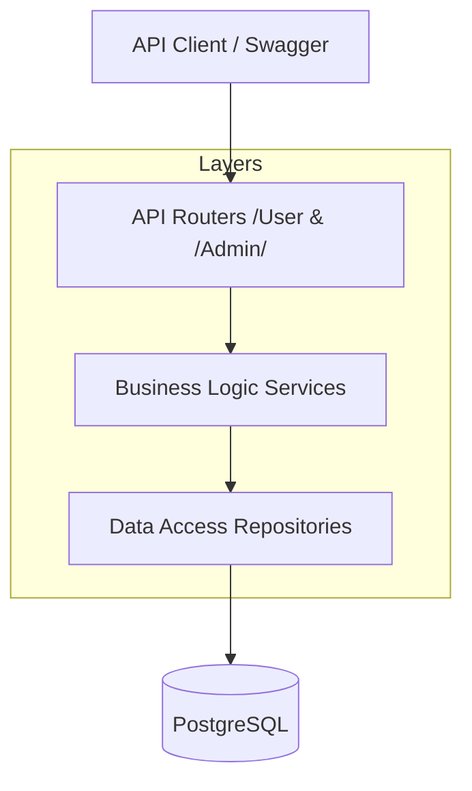

# FastAPI Delivery Service API 🍕

[](https://www.python.org/downloads/release/python-3120/)
[](https://fastapi.tiangolo.com/)
[]()
[]()
[]()

Современный, быстрый и надежный бэкенд для сервиса доставки еды. Проект разработан с упором на чистоту кода, типобезопасность и автоматическое тестирование.

---

##  Архитектура

Проект следует принципам **Layered Architecture** (Многослойная архитектура), что обеспечивает слабую связанность компонентов и легкость тестирования.



##  Технологический стек

*   **Core:** FastAPI (Async), Pydantic v2.
*   **Database:** PostgreSQL + SQLAlchemy 2.0 (Async Engine).
*   **Auth:** JWT + OTP (аутентификация по номеру телефона).
*   **Infrastructure:** Docker, Docker Compose, Alembic (миграции).
*   **CI/QA:** Pytest (Unit & Integration), Pytest-cov.

##  Ключевые возможности

*   **Auth Flow:** Безопасный вход без пароля (OTP через имитацию SMS).
*   **Cart System:** Умная корзина с расчетом стоимости и проверкой доступности блюд.
*   **Admin Power:** Полное управление меню, категориями и заказами через `/admin` эндпоинты.
*   **Robustness:** Обработка ошибок на глобальном уровне с понятными ответами.
*   **Reliability:** 100% покрытие бизнес-логики тестами.

---

##  Конфигурация (.env)

| Переменная | Описание | Значение по умолчанию |
| :--- | :--- | :--- |
| `DB_URL` | URL подключения к БД | `postgresql+asyncpg://...` |
| `SECRET_KEY` | Ключ для подписи JWT | *сгенерируйте свой* |
| `ALGORITHM` | Алгоритм шифрования JWT | `HS256` |
| `ACCESS_TOKEN_EXPIRE_MINUTES` | Время жизни токена | `1440` (24 часа) |
| `OTP_EXPIRE_MINUTES` | Время жизни OTP кода | `5` |

---

##  Быстрый старт

### Через Docker (Рекомендуется)
1. Скопируйте шаблон настроек: `cp .env.example .env`
2. Запустите проект:
```bash
docker compose up -d --build
```
*Swagger UI будет доступен по адресу: [http://localhost:8000/docs](http://localhost:8000/docs)*

### Локально
1. Создайте venv и установите зависимости: `pip install -r requirements.txt`
2. Примените миграции: `alembic upgrade head`
3. Запустите сервер: `uvicorn app.main:app --reload`


### Создание администратора через CLI

Когда контейнер с API уже запущен, можно создать администратора (или повысить существующего пользователя до администратора) по номеру телефона:

```bash
docker exec -it fastapidelivery_api python -m app.cli.create_admin +79990001122 --name "Super Admin"
```

Что делает команда:
- если пользователь с таким телефоном есть — меняет роль на `admin`;
- если пользователя нет — создаёт нового сразу с ролью `admin`.


---

##  Тестирование и Качество

Мы серьезно относимся к стабильности. В проекте настроены юнит-тесты для всей бизнес-логики и интеграционные тесты для всех API вызовов.

**Запуск тестов с генерацией отчета о покрытии:**
```bash
pytest -v tests/ --cov=app --cov-report=term-missing
```

**Статистика:**
- **Unit-тесты:** 15 (Сервисы)
- **Integration-тесты:** 12 (API)
- **Итого:** 27 тестов, **100% покрытие**.

---

##  Структура проекта

```text
app/
├── api/          # Слой представления (FastAPI Routers)
├── core/         # Глобальные настройки, БД, исключения
├── dependencies/ # Внедрение зависимостей (DI)
├── models/       # SQLAlchemy модели (Data Layer)
├── repositories/ # Слой доступа к данным (CRUD)
├── schemas/      # Pydantic схемы (DTO)
└── services/     # Бизнес-логика (Business Layer)
tests/            # Тестовая база проекта
```

##  Лицензия
Этот проект распространяется под лицензией MIT.
